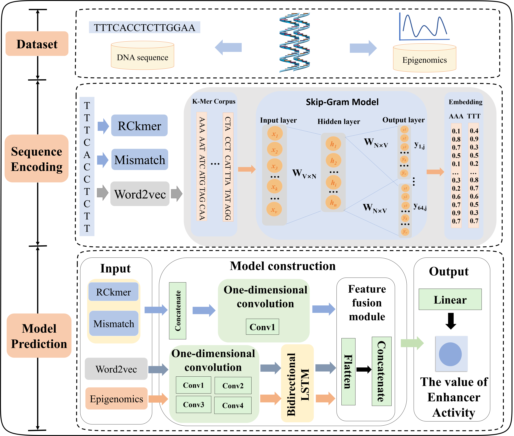

# EAP-LSTM
EAP-LSTM: A Bi-LSTM-based deep learning framework for quantitatively predicting enhancer activity in Drosophila and human cell lines. 
## Framework

## Overview
The folder "**data_drosophila**" contains the data of the drosophila enhancers, containing the sequences of the independent test sets, valid sets and training sets.
The folder "**data_human**" contains the data of the human enhancers, containing the sequences of the independent test sets, valid sets and training sets on five cell lines.  
The folder "**utils**" contains some essential utility functions.  
The file "**network.py**" is the code of the network architecture.  
The file "**main_drosophila.py**" is the code of the entire model to predict enhancer activity in Drosophila.   
The file "**main_human.py**" is the code of the entire model to predict enhancer activity in  human cell lines.
## Dependency
python 3.8.18   
pip 23.3.1  
keras 2.3.1  
tensorflow 2.2.0  
scikit-learn 1.2.1  
